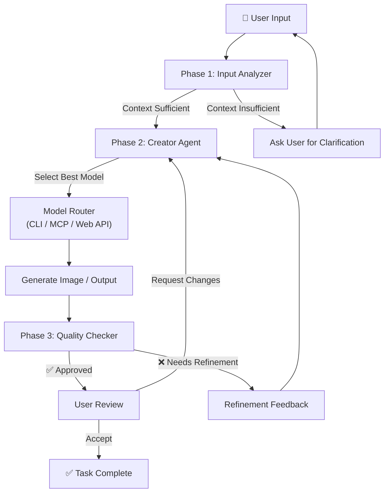
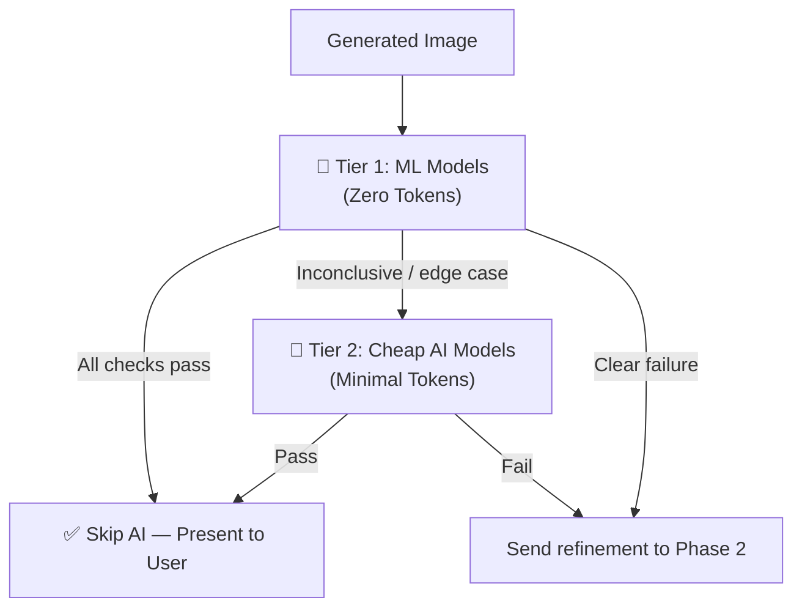
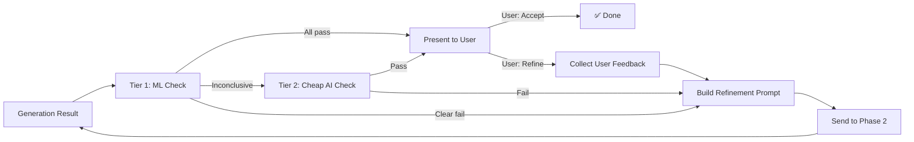

# Multi-Agent Orchestrator (MAO) — Implementation Plan

A modular, multi-phase agent orchestration system that intelligently processes user requests through three distinct architectural phases: **Input Understanding**, **Intelligent Creation**, and **Quality Verification** — with a human-in-the-loop refinement cycle.

---

## High-Level Architecture



---

## Fallback Rules — Agent Confusion Protocol

> [!NOTE]
> These rules are **only consulted when an agent is confused or uncertain** about what to do next. They act as a safety-net reference — not as strict enforcement on every run. If the agent has high confidence in its decision, it proceeds normally without checking these rules.

### Phase 1 — When Confused, Refer To:

| Rule | Detail |
|------|--------|
| **Understand the data model** | Parse the input to extract a structured data model — identify the subject, attributes, relationships, and constraints |
| **Check for reference images** | Always check if the user provided (or intended to provide) reference images, style sheets, or visual examples |
| **Clarify the goal** | If the goal is ambiguous, ask the user a direct question: *"What is the intended output?"* — don't guess |

> When Phase 1 is confused: slow down, re-read the input, extract `data model + reference image + goal`. If any of these three are missing or unclear, ask the user.

---

### Phase 2 — When Confused, Refer To:

| Rule | Default Tool / Model |
|------|----------------------|
| **Primary CLI** | Use `opencode` with `vision-best (auto)` — auto-selects the best vision-capable model |
| **MCP Servers** | Route through any connected MCP server that exposes generation tools |
| **Web Access** | Use web access tokens for external APIs (DALL-E, Flux, Midjourney, etc.) |
| **Fallback** | If unsure which backend, default to `opencode:vision-best(auto)` and let it auto-route |

> When Phase 2 is confused about model selection: default to `opencode:vision-best(auto)`. It auto-selects the best available vision model. For external generation, try MCP servers first, then web API tokens.

---

### Phase 3 — When Confused, Refer To:

| Rule | Default Tool / Model |
|------|----------------------|
| **Primary** | Use **Gemini CLI** or **Gemini free models** for quality verification |
| **Cost Priority** | Always prefer very cheap or low-powered AI models — Phase 3 should never use expensive models |
| **Auto-routing** | Use `omniroute:free-fast` for text-based quality checks |
| **Vision checks** | Use `omniroute:free-fast vision auto` for image quality and artifact detection |
| **Fallback** | If no free model is available, use the cheapest available model with vision capability |

> When Phase 3 is confused about which checker to use: auto-filter through `omniroute:free-fast` for text checks and `omniroute:free-fast vision auto` for image checks. The goal is **speed and cost-efficiency** — never use a premium model in Phase 3.

---

## Proposed Changes

### Phase 1 — Input Analyzer Agent

> **Goal**: Parse, understand, and validate user input before any generation begins. Ensures the orchestrator never wastes compute on ambiguous or incomplete requests.

#### [NEW] [input_analyzer.py](file:///Users/tejeshreddydevireddy/dheeraj%20MAO/agents/phase1/input_analyzer.py)

The core agent for Phase 1. Responsibilities:

| Step | Action | Detail |
|------|--------|--------|
| 1 | **Parse Input** | Tokenize and extract intent, subject, style, constraints from raw user text |
| 2 | **Context Check** | Determine if enough context is provided (e.g., dimensions, color palette, style references) |
| 3 | **Reference Detection** | Detect and validate any referenced files, URLs, or prior outputs |
| 4 | **Clarification Loop** | If context is insufficient, generate targeted clarification questions back to the user |
| 5 | **Output Structured Prompt** | Produce a normalized, enriched prompt object for Phase 2 |

**Key Data Structures:**

```python
@dataclass
class AnalyzedInput:
    raw_input: str
    intent: str                    # e.g., "generate_image", "edit_image"
    subject: str                   # e.g., "a futuristic cityscape"
    style: Optional[str]           # e.g., "cyberpunk, neon-lit"
    constraints: dict              # e.g., {"width": 1024, "height": 768}
    references: list[Reference]    # uploaded files, URLs, prior outputs
    context_score: float           # 0.0–1.0 confidence the input is sufficient
    missing_fields: list[str]      # what's still needed from the user
```

#### [NEW] [context_validator.py](file:///Users/tejeshreddydevireddy/dheeraj%20MAO/agents/phase1/context_validator.py)

- Scores input completeness against a configurable threshold (default: `0.7`)
- Returns a list of `missing_fields` if below threshold
- Validates that referenced files exist and are in supported formats

#### [NEW] [reference_resolver.py](file:///Users/tejeshreddydevireddy/dheeraj%20MAO/agents/phase1/reference_resolver.py)

- Resolves file paths, URLs, and prior conversation outputs
- Downloads and caches remote references
- Extracts metadata (dimensions, format, color profile) from image references

---

### Phase 2 — Creator Agent

> **Goal**: Take the filtered, validated input and intelligently route it to the best available model/tool for generation. This phase is the execution engine.

#### [NEW] [creator_agent.py](file:///Users/tejeshreddydevireddy/dheeraj%20MAO/agents/phase2/creator_agent.py)

The orchestration core of Phase 2. Responsibilities:

1. **Receive** the `AnalyzedInput` from Phase 1
2. **Select** the best generation backend via the Model Router
3. **Execute** the generation pipeline
4. **Return** the generated output with metadata

#### [NEW] [model_router.py](file:///Users/tejeshreddydevireddy/dheeraj%20MAO/agents/phase2/model_router.py)

Intelligent model selection engine. Picks the optimal backend based on:

| Factor | Description |
|--------|-------------|
| **Task Type** | Image gen, image edit, text-to-image, style transfer |
| **Quality Needs** | Draft vs. production quality |
| **Available Backends** | Which models/APIs are currently accessible |
| **Cost** | Prefer cheaper models for iterations, premium for final output |
| **Speed** | Fast models for drafts, slower high-quality for finals |

**Supported Backend Types:**

```python
class BackendType(Enum):
    CLI_TOOL = "cli"           # e.g., Stable Diffusion CLI, ComfyUI
    MCP_SERVER = "mcp"         # MCP-connected generation servers
    WEB_API = "web_api"        # REST APIs (DALL-E, Midjourney, Flux)
    LOCAL_MODEL = "local"      # Locally hosted models
```

#### [NEW] [backend_registry.py](file:///Users/tejeshreddydevireddy/dheeraj%20MAO/agents/phase2/backend_registry.py)

- Registry of all available generation backends
- Health checking and availability monitoring
- Capability matrix (what each backend can do)
- Configuration: API keys, endpoints, model versions

#### [NEW] [generation_pipeline.py](file:///Users/tejeshreddydevireddy/dheeraj%20MAO/agents/phase2/generation_pipeline.py)

- Translates the `AnalyzedInput` into backend-specific prompts
- Handles prompt engineering per-backend (e.g., DALL-E vs. Stable Diffusion syntax)
- Manages generation parameters (steps, CFG scale, sampler, seed)
- Returns `GenerationResult` with the output image + metadata

```python
@dataclass
class GenerationResult:
    image_path: str
    backend_used: str
    model_version: str
    generation_params: dict
    generation_time_ms: int
    cost_estimate: float
    prompt_used: str
```

---

### Phase 3 — Quality Checker Agent

> **Goal**: Use **machine learning models first** (zero token cost) and only fall back to cheap AI models when needed. This two-tier approach maximizes token savings while ensuring quality.

#### Two-Tier Verification Strategy



> [!TIP]
> **Token Savings**: Tier 1 handles ~70-80% of quality checks using local ML models that cost **zero tokens**. The AI model agent in Tier 2 is only invoked for ambiguous cases, dramatically reducing Phase 3 costs.

---

#### Tier 1 — Machine Learning Models (Zero Tokens)

#### [NEW] [ml_validators.py](file:///Users/tejeshreddydevireddy/dheeraj%20MAO/agents/phase3/ml_validators.py)

Local ML/CV models that run **without any API calls or token consumption**:

| Check | ML Method | Library | Token Cost |
|-------|-----------|---------|------------|
| **Prompt Alignment** | CLIP score (prompt ↔ image embedding similarity) | `open_clip` | **0 tokens** |
| **Artifact Detection** | Edge detection + anomaly scoring for glitches | `OpenCV` | **0 tokens** |
| **Face/Body Logic** | Landmark detection — catch extra limbs, wrong proportions | `MediaPipe` / `dlib` | **0 tokens** |
| **Composition** | Rule-of-thirds, symmetry, focal point analysis | `OpenCV` + heuristics | **0 tokens** |
| **Style Consistency** | Embedding similarity vs. reference images | `CLIP` / `DINO` | **0 tokens** |
| **Technical Quality** | Resolution, aspect ratio, color space, blur detection | `Pillow` + `OpenCV` | **0 tokens** |
| **Structural Similarity** | SSIM / LPIPS against reference if provided | `scikit-image` / `lpips` | **0 tokens** |
| **Text Readability** | OCR extracted text vs. expected text in prompt | `EasyOCR` / `Tesseract` | **0 tokens** |

```python
class MLValidators:
    """Zero-token quality checks using local ML models."""

    def clip_score(self, image_path: str, prompt: str) -> float:
        """CLIP similarity score — does the image match the prompt?"""

    def detect_artifacts(self, image_path: str) -> list[Artifact]:
        """OpenCV-based glitch/artifact detection."""

    def check_body_logic(self, image_path: str) -> BodyLogicResult:
        """MediaPipe landmark detection for anatomical correctness."""

    def structural_similarity(self, image_path: str, reference_path: str) -> float:
        """SSIM score against reference image."""

    def check_text_accuracy(self, image_path: str, expected_text: str) -> TextCheckResult:
        """OCR extraction + comparison with expected text."""

    def assess_composition(self, image_path: str) -> CompositionScore:
        """Rule-based composition analysis (thirds, symmetry, etc.)."""
```

---

#### Tier 2 — Cheap AI Models (Only When Needed)

#### [NEW] [quality_checker.py](file:///Users/tejeshreddydevireddy/dheeraj%20MAO/agents/phase3/quality_checker.py)

The AI-based checker — **only invoked when Tier 1 is inconclusive** (e.g., CLIP score is borderline, composition check is ambiguous). Uses the cheapest available models:

| Scenario | Model Used | Why |
|----------|-----------|-----|
| Tier 1 all pass | **No AI model called** | ML checks are sufficient — save all tokens |
| Tier 1 inconclusive | `omniroute:free-fast vision auto` | Cheapest vision model to resolve edge cases |
| Tier 1 clear failure | **No AI model called** | Directly send refinement notes to Phase 2 |
| Complex logic check | `Gemini CLI` / Gemini free models | Only for nuanced "does this make logical sense?" checks |

```python
@dataclass
class QualityReport:
    overall_score: float          # 0.0–1.0
    passed: bool                  # True if all checks pass threshold
    tier_used: str                # "ml_only" or "ml+ai" — tracks token usage
    ml_checks: list[MLCheckResult]     # Tier 1 results (zero tokens)
    ai_checks: list[AICheckResult]     # Tier 2 results (only if invoked)
    tokens_consumed: int          # 0 if ML-only, minimal if AI was needed
    refinement_notes: list[str]   # Actionable feedback for Phase 2
    iteration_count: int          # How many times we've refined
```

#### [NEW] [refinement_loop.py](file:///Users/tejeshreddydevireddy/dheeraj%20MAO/agents/phase3/refinement_loop.py)

Manages the iterative refinement cycle:



- Configurable max iteration count (default: `3`) before forcing user review
- Each iteration appends refinement context so the creator doesn't repeat mistakes
- User can break out of the loop at any time
- **Token tracking**: Reports how many tokens Phase 3 consumed (goal: zero for most iterations)

---

### Orchestrator Core

> **Goal**: The top-level controller that wires the three phases together and manages state.

#### [NEW] [orchestrator.py](file:///Users/tejeshreddydevireddy/dheeraj%20MAO/orchestrator.py)

The main entry point:

```python
class MAOrchestrator:
    def __init__(self, config: OrchestratorConfig):
        self.phase1 = InputAnalyzer(config.phase1)
        self.phase2 = CreatorAgent(config.phase2)
        self.phase3 = QualityChecker(config.phase3)

    async def run(self, user_input: str) -> FinalResult:
        # Phase 1: Understand
        analyzed = await self.phase1.analyze(user_input)
        if not analyzed.is_sufficient:
            return ClarificationRequest(analyzed.missing_fields)

        # Phase 2 + Phase 3: Create → Verify → Refine loop
        result = None
        for iteration in range(self.config.max_iterations):
            result = await self.phase2.generate(analyzed, refinement=result)
            quality = await self.phase3.evaluate(result, analyzed)

            if quality.passed:
                break
            # Auto-refine with quality feedback
            result.refinement_notes = quality.refinement_notes

        # User review gate
        return await self.present_to_user(result, quality)
```

#### [NEW] [config.py](file:///Users/tejeshreddydevireddy/dheeraj%20MAO/config.py)

- YAML/JSON-based configuration for all three phases
- Model selection preferences, API keys, thresholds
- Refinement loop limits and quality thresholds

#### [NEW] [state_manager.py](file:///Users/tejeshreddydevireddy/dheeraj%20MAO/state_manager.py)

- Tracks conversation state across the refinement loop
- Stores generation history (all iterations, not just the final)
- Enables "undo" / "go back to iteration N" for the user

---

### Project Structure

```
dheeraj MAO/
├── orchestrator.py              # Main entry point
├── config.py                    # Configuration management
├── state_manager.py             # Conversation & iteration state
├── config.yaml                  # Default configuration
│
├── agents/
│   ├── phase1/                  # Input Analyzer
│   │   ├── __init__.py
│   │   ├── input_analyzer.py
│   │   ├── context_validator.py
│   │   └── reference_resolver.py
│   │
│   ├── phase2/                  # Creator Agent
│   │   ├── __init__.py
│   │   ├── creator_agent.py
│   │   ├── model_router.py
│   │   ├── backend_registry.py
│   │   └── generation_pipeline.py
│   │
│   └── phase3/                  # Quality Checker
│       ├── __init__.py
│       ├── ml_validators.py     # Tier 1: Zero-token ML checks
│       ├── quality_checker.py   # Tier 2: Cheap AI fallback
│       └── refinement_loop.py
│
├── models/                      # Data models / schemas
│   ├── __init__.py
│   ├── input_models.py
│   ├── generation_models.py
│   └── quality_models.py
│
├── backends/                    # Backend adapters
│   ├── __init__.py
│   ├── base_backend.py
│   ├── cli_backend.py
│   ├── mcp_backend.py
│   └── web_api_backend.py
│
├── utils/                       # Shared utilities
│   ├── __init__.py
│   ├── logger.py
│   └── image_utils.py
│
├── tests/                       # Test suite
│   ├── test_phase1.py
│   ├── test_phase2.py
│   ├── test_phase3.py
│   └── test_orchestrator.py
│
└── requirements.txt
```

---

## User Review Required

> [!IMPORTANT]
> **Model Selection Strategy**: The plan assumes access to multiple image generation backends (CLI tools, MCP servers, web APIs). Please confirm which specific backends you want to support in the initial build (e.g., DALL-E, Stable Diffusion, Flux, Midjourney).

> [!IMPORTANT]
> **Quality Check Models**: Phase 3 uses "cheap/fast" models for verification. Do you want to use CLIP-based scoring, a small vision-language model (e.g., Gemini Flash, GPT-4o-mini), or both?

> [!WARNING]
> **API Keys & Cost**: Phase 2's web API backends will require API keys and may incur costs. The plan includes cost estimation per generation — confirm if you want hard budget limits enforced.

## Open Questions

1. **Language & Framework**: The plan uses Python with `asyncio`. Is Python your preferred language, or would you prefer TypeScript/Node.js?
2. **User Interface**: How should the user interact with the orchestrator? CLI? Web UI? Chat interface? API-only?
3. **Storage**: Where should generated images and iteration history be stored? Local filesystem? Cloud storage (S3/GCS)?
4. **Max Refinement Loops**: The default is 3 auto-refinement iterations before forcing user review. Is this a good default?
5. **Concurrency**: Should Phase 2 support generating multiple variants in parallel (e.g., 4 images at once, pick the best)?

---

## Verification Plan

### Automated Tests
```bash
# Unit tests for each phase
pytest tests/test_phase1.py -v
pytest tests/test_phase2.py -v
pytest tests/test_phase3.py -v

# Integration test for full orchestration loop
pytest tests/test_orchestrator.py -v

# Linting and type checking
ruff check .
mypy .
```

### Manual Verification
- Run the orchestrator end-to-end with a sample prompt
- Verify Phase 1 correctly identifies missing context and asks for clarification
- Verify Phase 2 selects the appropriate backend based on task type
- Verify Phase 3 catches intentionally flawed outputs and triggers refinement
- Verify the user review gate works — user can accept or request more changes
- Test the full refinement loop cycles correctly (Phase 3 → Phase 2 → Phase 3)
